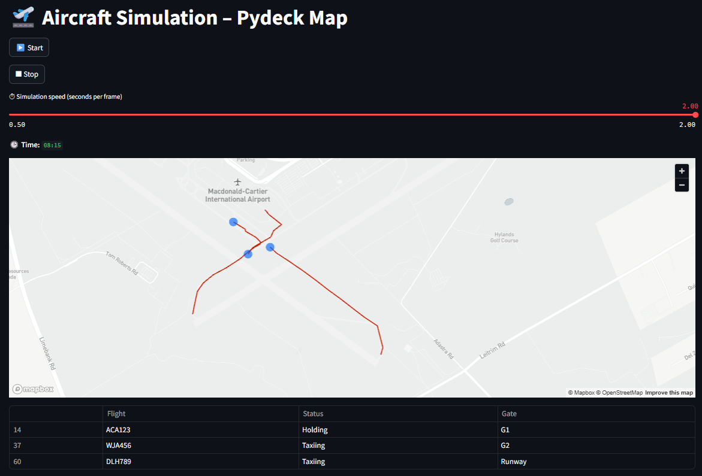
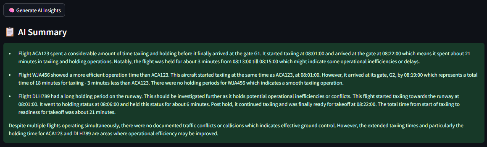

# ✈️ AeroNav AI

A real-time aircraft ground operations simulator for Ottawa International Airport — with AI-generated operational summaries powered by GPT-4.

This project simulates aircraft taxiing, holding, and gate arrivals over time, visualized live on a Pydeck-powered map. At any point, an AI assistant can analyze the full movement history and return a natural language summary of performance, delays, and traffic patterns.

---

## 🎯 Purpose

This tool demonstrates:

- Real-time simulation of airside activity
- Dynamic aircraft trails and live position mapping
- Flight coordination (including holding logic for conflicts)
- AI insight generation from real-world-style ops logs

Built for:
- Aviation data visualization
- Ground operations prototyping
- Interview & co-op project showcase

---

## 🗺 Features

✅ Realistic aircraft movement over time  
✅ Pydeck map with animated trails  
✅ Table of flight status and gate assignment  
✅ Conflict simulation with holding logic  
✅ GPT-4 powered AI summary generation  
✅ Clean Streamlit UI with no flicker  
✅ Fully local and customizable

---

## 📷 Screenshot

<table>
  <tr>
    <td></td>
    <td></td>
  </tr>
</table>

---

## 🧠 How It Works

1. Loads a custom CSV of aircraft movement over time
2. Simulates each time step on a map using Pydeck
3. Shows aircraft trails and current positions in real time
4. Tracks states like taxiing, holding, and arrivals
5. Optional: Uses OpenAI’s GPT-4 to generate a natural-language summary of the entire operation

---

## 🛠 Tech Stack

- **Streamlit** – UI & state handling  
- **Pandas** – Data filtering by time step  
- **Pydeck** – WebGL-powered aircraft visualization  
- **OpenAI GPT-4** – AI summarization engine  
- **dotenv** – Secure API key management

---

## 🚀 Getting Started

### 1. Clone this repo
git clone https://github.com/yourname/airfield-insights-lite.git
cd airfield-insights-lite
### 2. Set up environment
pip install -r requirements.txt
### 3. Add OpenAI API Key
Create a .env file in the root:
OPENAI_API_KEY=sk-...
### 4. Run the app
streamlit run main.py

--- 

## 🧪 Data Format
The simulation uses a CSV with these columns:
Time,Flight,Status,Gate,Lat,Lon
08:00,ACA123,Taxiing,A1,45.311376,-75.654606
📍 The coordinates were manually extracted over a real Ottawa airport layout to simulate realistic routes and interactions.

---

### 📁 Project Structure
├── main.py                     # Simulation engine & UI
├── data/
│   └── simulated_aircraft_movements.csv
├── scripts/
│   ├── plot_pydeck.py          # Builds aircraft map with trails
│   └── generate_insights.py    # AI summary logic
├── .env                        # OpenAI API key
├── requirements.txt
